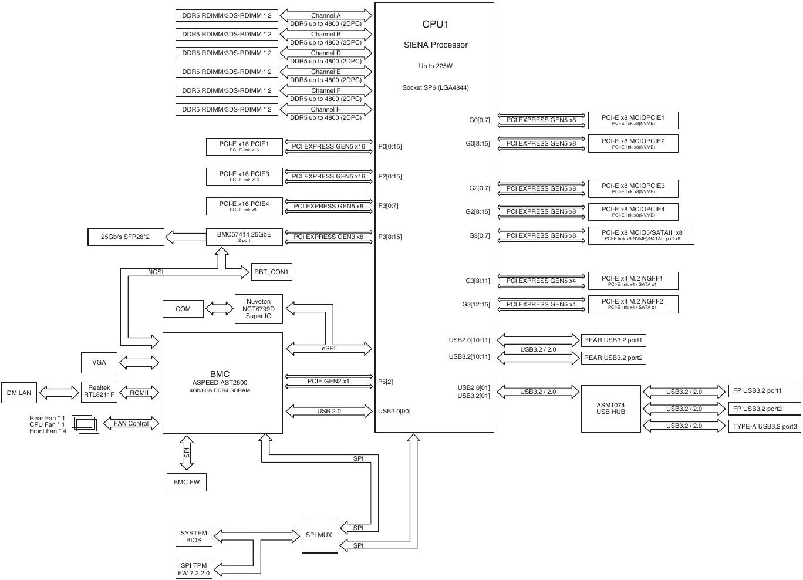

UEFI advanced configuration and reverse engineering on Asus S14NA-U12.

*BIOS Version used: 0304.*

# Configuring UEFI using UEFI shell

It is possible to perform advanced UEFI configuration using an UEFI shell and the
`setup_var.efi` utility. To do so:
* Copy the following files on a FAT32 USB drive and plug it in on the motherboard:
  * [Shell.efi](https://github.com/tianocore/edk2/blob/UDK2018/ShellBinPkg/UefiShell/X64/Shell.efi)
  * [setup_var.efi](https://github.com/datasone/setup_var.efi) 
* Ensure "Secure boot" is disabled in BIOS.
* Start the UEFI shell from the BIOS ("Exit/Boot Override/Launch EFI Shell from USB drives")
* Mount the USB drive, and execute the `setup_var.efi` commands:
  ```shell
  # List & mount availalable drives
  Shell> map -r

  # Select the USB drive
  Shell> FS0:

  # Run commands from the USB drive
  FS0:\> setup_var.efi # ...
  ```

## Enabling PCIE1 & PCIE3 x4x4x4x4 bifurcation

PCI-E bifurcation allows converting the x16 slot to a x4x4x4x4 slot.
This can be used with a PCI-E card (like [ASUS Hyper M.2 x16 Gen5 Card](https://www.asus.com/motherboards-components/motherboards/accessories/hyper-m-2-x16-gen5-card/))
with up to 4x M2 NVME PCI-E 5.0 SSDs.

First, we need to set the `Quick Switch` option to `Manual`:
```shell
setup_var.efi 0x0 0x1 -n AsusCpmDxioTopology
```

We can now configure each PCI-E slot individually.

PCIE1 (P0 link) configuration:
```shell
setup_var.efi 0x1 0x4 -n AsusCpmDxioTopology
setup_var.efi 0xE3 0x1 -n AsusCpmDxioTopology
setup_var.efi 0xE5 0x1 -n AsusCpmDxioTopology
setup_var.efi 0xE7 0x1 -n AsusCpmDxioTopology
```

PCIE3 (P2 link) configuration:
```shell
setup_var.efi 0x4 0x4 -n AsusCpmDxioTopology
setup_var.efi 0xFB 0x1 -n AsusCpmDxioTopology
setup_var.efi 0xFD 0x1 -n AsusCpmDxioTopology
setup_var.efi 0xFF 0x1 -n AsusCpmDxioTopology
```

# Finding hidden UEFI parameters

This method allow finding hidden bios parameters and prepare the associated commands
to use with the `setup_var.efi` command in a UEFI shell

* Download and extract BIOS image from [ASUS Website](https://servers.asus.com/products/servers/server-motherboards/S14NA-U12#Resources).
* Use [UEFITool](https://github.com/LongSoft/UEFITool) to open the extracted `.cap` file.
  * Search `Setup` ext and find the `Setup/*` section
  * Extract body if the `Setup` folder as a file.
* Use [IFR-Extractor](https://github.com/LongSoft/Universal-IFR-Extractor) to convert the extracted file to txt (`ifrextractor File_DXE_driver_Setup_body.fbd`).
* Open the resulting text file with a text editor:
  * Search for the desired setting to find `VarStoreId`, `VarOffset`, `Size` and possible values.
  * Search for `VarStoreId` to find the related `VarStoreName`.
* Based on this information, we can determine the required `setup_var.efi` commands
  (All decimal must be converted in hexadecimal in `0x` format)
  ```shell
  # Get setup_var.efi help
  setup_var.efi -h

  # Read current value for
  setup_var.efi <VarOffset> -n <VarStoreName>

  # Write a new value
  setup_var.efi <VarOffset> <Value> -n <VarStoreName>

  # Write a new value, apply and reboot
  setup_var.efi <VarOffset> <Value> -n <VarStoreName> -r
  ```

## Examples

### PCI-E Bifurcation "Quick Switch" manual option

Based on the block diagram from the motherboard manual, we can see that both PCI-E 5.0 16x
slots are mapped on P0 and P2 links.



Because of the following `GrayOutIf` block on bifurcation options,
we need to set the option with `QuestionId: 0xD7` to something different thant `0x0`.
```requirements
GrayOutIf
    EqIdVal QuestionId: 0xD7, Value: 0x0
    # [...]
End
```

With the `QuestionId`, we can found the related option to change,
`Quick Switch` and that we need to set it to `Manual`.
```requirements
OneOf Prompt: "Quick Switch", Help: "Quick Switch", QuestionFlags: 0x10, QuestionId: 0xD7, VarStoreId: 0x13, VarOffset: 0x0, Flags: 0x10, Size: 8, Min: 0x0, Max: 0x1, Step: 0x0
    OneOfOption Option: "Auto" Value: 0, Default
    OneOfOption Option: "Manual" Value: 1
End
```

We can also find the VarStore name for `VarStoreId: 0x13` that is required for all 
bifurcation related options: `AsusCpmDxioTopology`
```requirements
VarStore Guid: B824A9D7-F0AE-42E8-A5FF-A3DBE96E705B, VarStoreId: 0x13, Size: 0x279, Name: "AsusCpmDxioTopology"
```

As a result:
* VarOffset: `0x0`
* Value: `0x1`
* VarStoreName: `AsusCpmDxioTopology` (VarStoreId: `0x13`)

### PCIE1 (P0 link) x4x4x4x4 bifurcation

Bifurcation mode:
```requirements
OneOf Prompt: "Socket0 Plink 0", Help: "Socket0 Plink 0", QuestionFlags: 0x14, QuestionId: 0x2AB5, VarStoreId: 0x13, VarOffset: 0x1, Flags: 0x10, Size: 8, Min: 0x0, Max: 0x4, Step: 0x0
    Default DefaultId: 0x0 Value: 0
    OneOfOption Option: "X16" Value: 0
    OneOfOption Option: "X8X8" Value: 1
    OneOfOption Option: "X4X4X8" Value: 2
    OneOfOption Option: "X8X4X4" Value: 3
    OneOfOption Option: "X4X4X4X4" Value: 4
End
```
* VarOffset: `0x1`
* Value: `0x4` (X4X4X4X4)
* VarStoreName: `AsusCpmDxioTopology` (VarStoreId: `0x13`)

Engine Type for first device (PCI-E lanes 0-3):
Based on the `Default` value, we can see that PCIe Engine is already enabled, so nothing to do.
```requirements
OneOf Prompt: "  Engine Type", Help: "  Engine Type", QuestionFlags: 0x10, QuestionId: 0xE5, VarStoreId: 0x13, VarOffset: 0xE1, Flags: 0x10, Size: 8, Min: 0x0, Max: 0x1, Step: 0x0
    Default DefaultId: 0x0 Value: 1
    OneOfOption Option: "Unused Engine" Value: 0
    OneOfOption Option: "PCIe Engine" Value: 1
End
```
It is also possible to verify the currently configured PCI-E lanes for the current section based on the following parameters:
```requirements
Numeric Prompt: "  Start Lanes", Help: "  Start Lanes", QuestionFlags: 0x10, QuestionId: 0xE6, VarStoreId: 0x13, VarOffset: 0x15, Flags: 0x10, Size: 8, Min: 0x0, Max: 0xFF, Step: 0x1
    Default DefaultId: 0x0 Value: 0
End 
Numeric Prompt: "  End Lanes", Help: "  End Lanes", QuestionFlags: 0x10, QuestionId: 0xE7, VarStoreId: 0x13, VarOffset: 0x59, Flags: 0x10, Size: 8, Min: 0x0, Max: 0xFF, Step: 0x1
    Default DefaultId: 0x0 Value: 15
End 
```
This command will show start and end lanes:
```shell
setup_var.efi 0x15 -n AsusCpmDxioTopology
setup_var.efi 0x59 -n AsusCpmDxioTopology
```
If you check lane start/end for on another PCI-E slot, there will be an offset. PCI-E lanes are numbered at the CPU level, not at each slot level.

Engine Type for second device (PCI-E lanes 4-7):
```requirements
OneOf Prompt: "  Engine Type", Help: "  Engine Type", QuestionFlags: 0x10, QuestionId: 0xF9, VarStoreId: 0x13, VarOffset: 0xE3, Flags: 0x10, Size: 8, Min: 0x0, Max: 0x1, Step: 0x0
    Default DefaultId: 0x0 Value: 0
    OneOfOption Option: "Unused Engine" Value: 0
    OneOfOption Option: "PCIe Engine" Value: 1
End
```
* VarOffset: `0xE3`
* Value: `0x1` (PCIe Engine)
* VarStoreName: `AsusCpmDxioTopology` (VarStoreId: `0x13`)

Engine Type for third device (PCI-E lanes 8-11):
```requirements
OneOf Prompt: "  Engine Type", Help: "  Engine Type", QuestionFlags: 0x10, QuestionId: 0x10D, VarStoreId: 0x13, VarOffset: 0xE5, Flags: 0x10, Size: 8, Min: 0x0, Max: 0x1, Step: 0x0
    Default DefaultId: 0x0 Value: 0
    OneOfOption Option: "Unused Engine" Value: 0
    OneOfOption Option: "PCIe Engine" Value: 1
End
```
* VarOffset: `0xE5`
* Value: `0x1` (PCIe Engine)
* VarStoreName: `AsusCpmDxioTopology` (VarStoreId: `0x13`)

Engine Type for fourth device (PCI-E lanes 12-15):
```requirements
OneOf Prompt: "  Engine Type", Help: "  Engine Type", QuestionFlags: 0x10, QuestionId: 0x121, VarStoreId: 0x13, VarOffset: 0xE7, Flags: 0x10, Size: 8, Min: 0x0, Max: 0x1, Step: 0x0
    Default DefaultId: 0x0 Value: 0
    OneOfOption Option: "Unused Engine" Value: 0
    OneOfOption Option: "PCIe Engine" Value: 1
End
```
* VarOffset: `0xE7`
* Value: `0x1` (PCIe Engine)
* VarStoreName: `AsusCpmDxioTopology` (VarStoreId: `0x13`)

### PCIE3 (P2 link) x4x4x4x4 bifurcation

Bifurcation mode:
```requirements
OneOf Prompt: "Socket0 Plink 2", Help: "Socket0 Plink 2", QuestionFlags: 0x14, QuestionId: 0x2ABB, VarStoreId: 0x13, VarOffset: 0x4, Flags: 0x10, Size: 8, Min: 0x0, Max: 0x4, Step: 0x0
    Default DefaultId: 0x0 Value: 0
    OneOfOption Option: "X16" Value: 0
    OneOfOption Option: "X8X8" Value: 1
    OneOfOption Option: "X4X4X8" Value: 2
    OneOfOption Option: "X8X4X4" Value: 3
    OneOfOption Option: "X4X4X4X4" Value: 4
End
```
* VarOffset: `0x4`
* Value: `0x4` (X4X4X4X4)
* VarStoreName: `AsusCpmDxioTopology` (VarStoreId: `0x13`)

Engine Type for first device: Like previously, this is already configured by default
```requirements
OneOf Prompt: "  Engine Type", Help: "  Engine Type", QuestionFlags: 0x10, QuestionId: 0x1D5, VarStoreId: 0x13, VarOffset: 0xF9, Flags: 0x10, Size: 8, Min: 0x0, Max: 0x1, Step: 0x0
    Default DefaultId: 0x0 Value: 1
    OneOfOption Option: "Unused Engine" Value: 0
    OneOfOption Option: "PCIe Engine" Value: 1
End
```

Engine Type for second device:
```requirements
OneOf Prompt: "  Engine Type", Help: "  Engine Type", QuestionFlags: 0x10, QuestionId: 0x1E9, VarStoreId: 0x13, VarOffset: 0xFB, Flags: 0x10, Size: 8, Min: 0x0, Max: 0x1, Step: 0x0
    Default DefaultId: 0x0 Value: 0
    OneOfOption Option: "Unused Engine" Value: 0
    OneOfOption Option: "PCIe Engine" Value: 1
End
```
* VarOffset: `0xFB`
* Value: `0x1` (PCIe Engine)
* VarStoreName: `AsusCpmDxioTopology` (VarStoreId: `0x13`)

Engine Type for third device:
```requirements
OneOf Prompt: "  Engine Type", Help: "  Engine Type", QuestionFlags: 0x10, QuestionId: 0x1FD, VarStoreId: 0x13, VarOffset: 0xFD, Flags: 0x10, Size: 8, Min: 0x0, Max: 0x1, Step: 0x0
    Default DefaultId: 0x0 Value: 0
    OneOfOption Option: "Unused Engine" Value: 0
    OneOfOption Option: "PCIe Engine" Value: 1
End
```
* VarOffset: `0xFD`
* Value: `0x1` (PCIe Engine)
* VarStoreName: `AsusCpmDxioTopology` (VarStoreId: `0x13`)

Engine Type for fourth device:
```requirements
OneOf Prompt: "  Engine Type", Help: "  Engine Type", QuestionFlags: 0x10, QuestionId: 0x211, VarStoreId: 0x13, VarOffset: 0xFF, Flags: 0x10, Size: 8, Min: 0x0, Max: 0x1, Step: 0x0
    Default DefaultId: 0x0 Value: 0
    OneOfOption Option: "Unused Engine" Value: 0
    OneOfOption Option: "PCIe Engine" Value: 1
End
```
* VarOffset: `0xFF`
* Value: `0x1` (PCIe Engine)
* VarStoreName: `AsusCpmDxioTopology` (VarStoreId: `0x13`)
